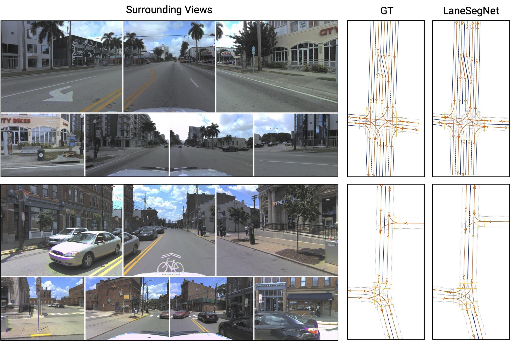

<div align="center">

# LaneSegNet: Map Learning with Lane Segment Perception for Autonomous Driving

[](https://arxiv.org/abs/2312.xxxxx)
[](https://github.com/OpenDriveLab/OpenLane-V2)
[](./LICENSE)




</div>

## News
- [2023/12/07] LaneSegNet [paper](https://arxiv.org/abs/2304.xxxxx) is available on arXiv.
- Code & model will be released soon. Please stay tuned!

## License

All assets and code are under the [Apache 2.0 license](./LICENSE) unless specified otherwise.

## Citation
If this work is helpful for your research, please consider citing the following BibTeX entry.

``` bibtex
@article{li2023lanesegnet,
  title={LaneSegNet: Map Learning with Lane Segment Perception for Autonomous Driving},
  author={Li, Tianyu and Jia, Peijin and Wang, Bangjun and Chen, Li and Jiang, Kun and Yan, Junchi and Li, Hongyang},
  journal={arXiv preprint arXiv:2312.xxxxx},
  year={2023}
}

@inproceedings{wang2023openlanev2,
  title={OpenLane-V2: A Topology Reasoning Benchmark for Unified 3D HD Mapping}, 
  author={Wang, Huijie and Li, Tianyu and Li, Yang and Chen, Li and Sima, Chonghao and Liu, Zhenbo and Wang, Bangjun and Jia, Peijin and Wang, Yuting and Jiang, Shengyin and Wen, Feng and Xu, Hang and Luo, Ping and Yan, Junchi and Zhang, Wei and Li, Hongyang},
  booktitle={NeurIPS},
  year={2023}
}
```

## Related resources

We acknowledge all the open-source contributors for the following projects to make this work possible:

- [Openlane-V2](https://github.com/OpenDriveLab/OpenLane-V2)
- [BEVFormer](https://github.com/fundamentalvision/BEVFormer)
- [TopoNet](https://github.com/OpenDriveLab/TopoNet)
