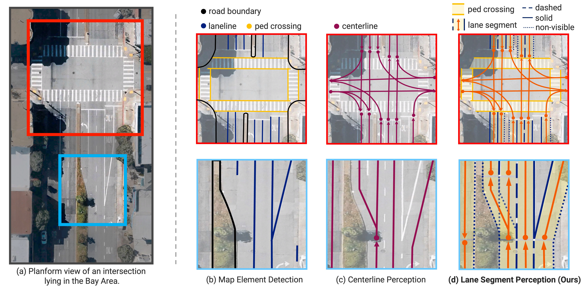

<div align="center">

# LaneSegNet: Map Learning with Lane Segment Perception for Autonomous Driving

[](https://arxiv.org/abs/2312.16108)
[](https://github.com/OpenDriveLab/OpenLane-V2)
[](./LICENSE)



</div>

> - :mailbox_with_mail: Primary contact: [Tianyu Li](https://scholar.google.com/citations?user=X6vTmEMAAAAJ) ( litianyu@opendrivelab.com )
> - [arXiv paper](https://arxiv.org/abs/2312.16108) | [OpenReview](https://openreview.net/forum?id=LsURkIPYR5), ICLR 2024
> - [Blog (Zhihu)](https://zhuanlan.zhihu.com/p/678596087) | [Slides TODO]()

## Highlights

:fire: We advocate **Lane Segment** as a map learning paradigm that seamlessly incorporates both map :motorway: geometry and :spider_web: topology information.

:checkered_flag: **Lane Segment** and **`OpenLane-V2 Map Element Bucket`** serve as a track in the **`CVPR 2024 Autonomous Grand Challenge`**.

> - Official website: :globe_with_meridians: [AGC2024 Mapless Driving](https://opendrivelab.com/challenge2024/#mapless_driving)
> - Evaluation server: :hugs: [Hugging Face](https://huggingface.co/spaces/AGC2024/mapless-driving-2024)

This repository can be used as a starting point for Mapless Driving track.


## News
- **`[2024/3]`** We released a multi-head version of LaneSegNet for the OpenLane-V2 Map Element Bucket!
  - Refer to this [config](projects/configs/lanesegnet_r50_8x1_24e_olv2_subset_A_mapele_bucket.py) file to train the baseline!
  - Please use the `*_ls.pkl` files generated by [OpenLane-V2](https://github.com/OpenDriveLab/OpenLane-V2/tree/master/data#preprocess) preprocess scripts!
  - You can use `./tools/dist_test.sh {GPUs} --format-only` to generate the `submission.pkl` now!
- **`[2023/12]`** LaneSegNet [paper](https://arxiv.org/abs/2312.16108) is available on arXiv. Code is also released!

---


<div align="center">
<b>Overall pipeline of LaneSegNet</b>
</div>

## Table of Contents
- [Model Zoo](#model-zoo)
- [Prerequisites](#prerequisites)
- [Installation](#installation)
- [Prepare Dataset](#prepare-dataset)
- [Train and Evaluate](#train-and-evaluate)
- [License and Citation](#license-and-citation)

## Model Zoo

> [!NOTE]
> The evaluation results below are based on OpenLane-V2 devkit `v2.1.0`. In this version, we have addressed a loophole in the TOP metric, which caused the TOP<sub>lsls</sub> value to be significantly higher than what was reported in the paper.  
> For more details please see issue [#76](https://github.com/OpenDriveLab/OpenLane-V2/issues/76) of OpenLane-V2.

### Performance in LaneSegNet paper

|   Model    | Epoch |  mAP  | TOP<sub>lsls</sub> | Memory | Config | Download |
| :--------: | :---: | :---: | :----------------: | :----: | :----: | :------: |
| LaneSegNet | 24 | 33.5 | 25.4 | 9.4G | [config](projects/configs/lanesegnet_r50_8x1_24e_olv2_subset_A.py) | [ckpt](https://huggingface.co/OpenDriveLab/lanesegnet_r50_8x1_24e_olv2_subset_A/resolve/main/lanesegnet_r50_8x1_24e_olv2_subset_A.pth) / [log](https://huggingface.co/OpenDriveLab/lanesegnet_r50_8x1_24e_olv2_subset_A/resolve/main/20231225_213951.log) |

> The mean AP is between lane segment and pedestrian crossing.

### Performance on OpenLane-V2 Map Element Bucket

| Model | Epoch | DET<sub>ls</sub> | DET<sub>a</sub> | DET<sub>t</sub> | TOP<sub>lsls</sub> | TOP<sub>lste</sub> | Config |
| :---: | :---: | :---: | :---: | :---: | :---: | :---: | :---: |
| LaneSegNet-meb | 24 | 27.8 | 23.8 | 36.9 | 24.1 | 21.3 | [config](projects/configs/lanesegnet_r50_8x1_24e_olv2_subset_A_mapele_bucket.py) |

> This is a naive multi-branch model for the Map Element Bucket.  
> The pedestrian and road boundary are detected by an additional MapTR head. The traffic element are detected by a Deformable DETR head. The hyper-parameters are roughly set.

## Prerequisites

- Linux
- Python 3.8.x
- NVIDIA GPU + CUDA 11.1
- PyTorch 1.9.1

## Installation

We recommend using [conda](https://docs.conda.io/en/latest/miniconda.html) to run the code.
```bash
conda create -n lanesegnet python=3.8 -y
conda activate lanesegnet

# (optional) If you have CUDA installed on your computer, skip this step.
conda install cudatoolkit=11.1.1 -c conda-forge

pip install torch==1.9.1+cu111 torchvision==0.10.1+cu111 -f https://download.pytorch.org/whl/torch_stable.html
```

Install mm-series packages.
```bash
pip install mmcv-full==1.5.2 -f https://download.openmmlab.com/mmcv/dist/cu111/torch1.9.0/index.html
pip install mmdet==2.26.0
pip install mmsegmentation==0.29.1
pip install mmdet3d==1.0.0rc6
```

Install other required packages.
```bash
pip install -r requirements.txt
```

## Prepare Dataset

Following [OpenLane-V2 repo](https://github.com/OpenDriveLab/OpenLane-V2/blob/v2.1.0/data) to download the **Image** and the **Map Element Bucket** data. Run the following script to collect data for this repo. 

> [!IMPORTANT]
> 
> :exclamation: Please note that the script for generating LaneSegNet data is not the same as the OpenLane-V2 Map Element Bucket. The `*_lanesegnet.pkl` is not the same as the `*_ls.pkl`.
> 
> :bell: The `Map Element Bucket` has been updated as of October 2023. Please ensure you download the most recent data.

```bash
cd LaneSegNet
mkdir data

ln -s {Path to OpenLane-V2 repo}/data/OpenLane-V2 ./data/
python ./tools/data_process.py
```

After setup, the hierarchy of folder `data` is described below:
```
data/OpenLane-V2
├── train
|   └── ...
├── val
|   └── ...
├── test
|   └── ...
├── data_dict_subset_A_train_lanesegnet.pkl
├── data_dict_subset_A_val_lanesegnet.pkl
├── ...
```

## Train and Evaluate

### Train

We recommend using 8 GPUs for training. If a different number of GPUs is utilized, you can enhance performance by configuring the `--autoscale-lr` option. The training logs will be saved to `work_dirs/lanesegnet`.

```bash
cd LaneSegNet
mkdir -p work_dirs/lanesegnet

./tools/dist_train.sh 8 [--autoscale-lr]
```

### Evaluate
You can set `--show` to visualize the results.

```bash
./tools/dist_test.sh 8 [--show]
```

## License and Citation
All assets and code are under the [Apache 2.0 license](./LICENSE) unless specified otherwise.

If this work is helpful for your research, please consider citing the following BibTeX entry.

``` bibtex
@inproceedings{li2023lanesegnet,
  title={LaneSegNet: Map Learning with Lane Segment Perception for Autonomous Driving},
  author={Li, Tianyu and Jia, Peijin and Wang, Bangjun and Chen, Li and Jiang, Kun and Yan, Junchi and Li, Hongyang},
  booktitle={ICLR},
  year={2024}
}

@inproceedings{wang2023openlanev2,
  title={OpenLane-V2: A Topology Reasoning Benchmark for Unified 3D HD Mapping}, 
  author={Wang, Huijie and Li, Tianyu and Li, Yang and Chen, Li and Sima, Chonghao and Liu, Zhenbo and Wang, Bangjun and Jia, Peijin and Wang, Yuting and Jiang, Shengyin and Wen, Feng and Xu, Hang and Luo, Ping and Yan, Junchi and Zhang, Wei and Li, Hongyang},
  booktitle={NeurIPS},
  year={2023}
}
```

## Related resources

We acknowledge all the open-source contributors for the following projects to make this work possible:

- [Openlane-V2](https://github.com/OpenDriveLab/OpenLane-V2)
- [BEVFormer](https://github.com/fundamentalvision/BEVFormer)
- [TopoNet](https://github.com/OpenDriveLab/TopoNet)
- [PersFormer](https://github.com/OpenDriveLab/PersFormer_3DLane)
- [OpenLane](https://github.com/OpenDriveLab/OpenLane)
- [MapTR](https://github.com/hustvl/MapTR)
